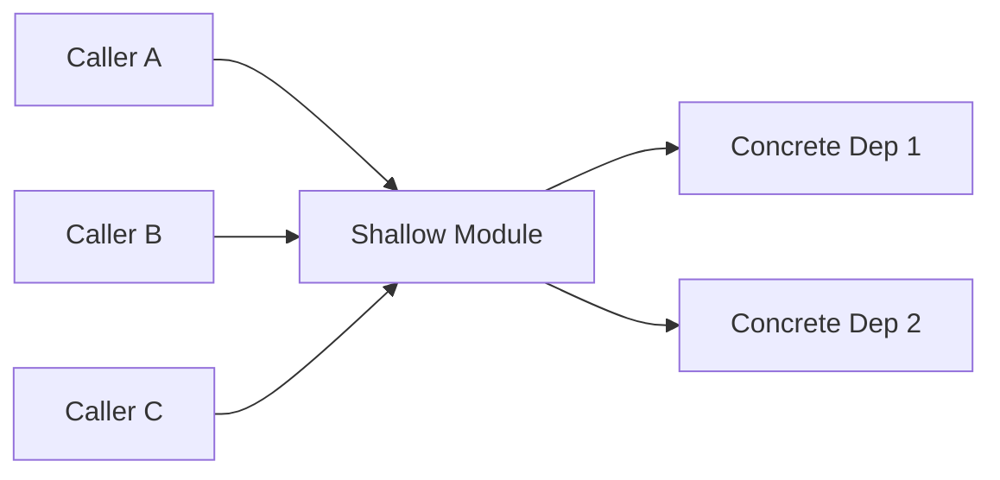
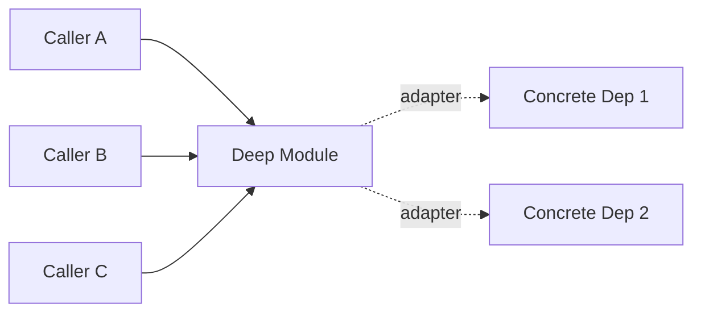

# Architecture Review -- `<scope>`

`<One-paragraph framing: what was reviewed, why, and what the user said in
Phase 1 about pain points and success criteria. No more than 4 sentences.>`

## Glossary Anchors Used

Every recommendation below cites these anchors. Definitions live in
[docs/Glossary.md](../Glossary.md).

- [`<TermOne>`](../Glossary.md#termone)
- [`<TermTwo>`](../Glossary.md#termtwo)
- ...

## Candidates

---

### C1 -- `<title>`

**Recommendation strength:** must | should | consider
**Dependency category:** in-process | local-substitutable | remote-but-owned | true-external
**Glossary terms:** [`<TermOne>`](../Glossary.md#termone), [`<TermTwo>`](../Glossary.md#termtwo)

**Problem.** `<one sentence>`

**Solution.** `<one sentence>`

**Affected files.**
- `path/to/file-1`
- `path/to/file-2`
- `path/to/file-3`

**Depth / Locality / Seam analysis.**
- **Depth:** `<what behavior currently spans the interface; how it would
  consolidate after deepening>`
- **Locality:** `<where changes concentrate today; where they would
  concentrate after>`
- **Seam placement:** `<where the interface lives now; where it should live;
  whether two distinct adapters justify a port>`

**Deletion test.** `<If this module were deleted, what happens at the N
callers? If complexity reappears at callers, the module is earning its keep
and the recommendation is to deepen it. If complexity vanishes, the
recommendation may be to delete it entirely.>`

**Before**

**After**

**Trade-offs.**
- `<gain 1>`
- `<gain 2>`
- `<cost 1>`
- `<cost 2>`

**Glossary consistency notes.**
- `<term substitution observed during review, e.g.: "FetchService" used in
  src/api/ for what the glossary calls "FetchAdapter" -- recommend renaming
  during the deepening>`

---

### C2 -- `<title>`

`<repeat the C1 structure>`

---

## Top Recommendation

**C<n> -- `<title>`** -- `<one paragraph: why this candidate beats the
others on depth, locality, and seam placement combined, and what success
looks like at acceptance.>`

## Phase 3 Hooks

If the user proceeds with grilling on a candidate, the parallel
interface-design sub-agents receive this brief:

- Candidate ID and title
- Dependency category (drives port-and-adapter advice)
- Glossary anchors that constrain vocabulary in the proposed interface
- Affected files
- The four mandates (minimize, maximize-flexibility, common-case,
  ports-and-adapters where applicable)

## Closing Notes

- Reopenable ADRs flagged during Phase 1: `<list or "none">`
- Glossary state after this session: `<created | updated | ratified>` with
  `<N>` canonical terms
- Stigmergic handoff: `<which slash command is appropriate next, e.g.
  "/nextTask once a task is added to docs/ToDos.md">`
